# MerbsConnect - System Logical Flow Documentation

This document explains the logical flow and architecture of each major functionality in the MerbsConnect application.

---

## Table of Contents

1. [System Architecture Overview](#1-system-architecture-overview)
2. [Authentication Flow](#2-authentication-flow)
3. [Event Management Flow](#3-event-management-flow)
4. [Event Registration & Check-in Flow](#4-event-registration--check-in-flow)
5. [Event Reviews System](#5-event-reviews-system)
6. [Event Gallery System](#6-event-gallery-system)
7. [Event Articles System](#7-event-articles-system)
8. [SMS Notification System](#8-sms-notification-system)
9. [Admin Dashboard Flow](#9-admin-dashboard-flow)
10. [Storage System](#10-storage-system)

---

## 1. System Architecture Overview

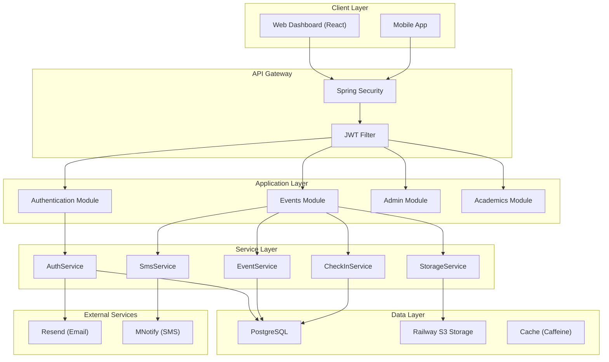
```mermaid
graph TB
    subgraph "Client Layer"
        WEB["Web Dashboard (React)"]
        MOBILE["Mobile App"]
    end
    
    subgraph "API Gateway"
        SEC["Spring Security"]
        JWT["JWT Filter"]
    end
    
    subgraph "Application Layer"
        AUTH["Authentication Module"]
        EVENTS["Events Module"]
        ADMIN["Admin Module"]
        ACADEMICS["Academics Module"]
    end
    
    subgraph "Service Layer"
        AUTH_SVC["AuthService"]
        EVENT_SVC["EventService"]
        CHECKIN_SVC["CheckInService"]
        SMS_SVC["SmsService"]
        STORAGE_SVC["StorageService"]
    end
    
    subgraph "Data Layer"
        PG["PostgreSQL"]
        S3["Railway S3 Storage"]
        REDIS["Cache (Caffeine)"]
    end
    
    subgraph "External Services"
        RESEND["Resend (Email)"]
        MNOTIFY["MNotify (SMS)"]
    end

    WEB --> SEC
    MOBILE --> SEC
    SEC --> JWT
    JWT --> AUTH
    JWT --> EVENTS
    JWT --> ADMIN
    JWT --> ACADEMICS
    
    AUTH --> AUTH_SVC
    EVENTS --> EVENT_SVC
    EVENTS --> CHECKIN_SVC
    EVENTS --> SMS_SVC
    EVENTS --> STORAGE_SVC
    
    AUTH_SVC --> PG
    EVENT_SVC --> PG
    CHECKIN_SVC --> PG
    STORAGE_SVC --> S3
    
    AUTH_SVC --> RESEND
    SMS_SVC --> MNOTIFY
```

### Key Components

| Component | Technology | Purpose |
|-----------|------------|---------|
| Backend | Spring Boot 4 | REST API Server |
| Security | Spring Security + JWT | Authentication/Authorization |
| Database | PostgreSQL | Persistent data storage |
| Storage | Railway S3 | Media file storage |
| Email | Resend API | Transactional emails |
| SMS | MNotify API | SMS notifications |
| Cache | Caffeine | In-memory caching |

---

## 2. Authentication Flow

### 2.1 User Registration Flow

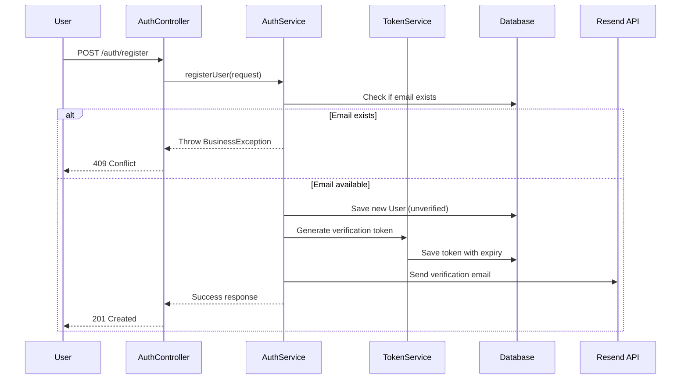
```mermaid
sequenceDiagram
    participant User
    participant Controller as AuthController
    participant Service as AuthService
    participant Token as TokenService
    participant DB as Database
    participant Email as Resend API
    
    User->>Controller: POST /auth/register
    Controller->>Service: registerUser(request)
    Service->>DB: Check if email exists
    alt Email exists
        Service-->>Controller: Throw BusinessException
        Controller-->>User: 409 Conflict
    else Email available
        Service->>DB: Save new User (unverified)
        Service->>Token: Generate verification token
        Token->>DB: Save token with expiry
        Service->>Email: Send verification email
        Service-->>Controller: Success response
        Controller-->>User: 201 Created
    end
```

**Key Points:**
- Password is hashed using BCrypt before storage
- Verification token expires after configurable hours (default: 24)
- Rate limiting prevents spam registration attempts

---

### 2.2 Login Flow

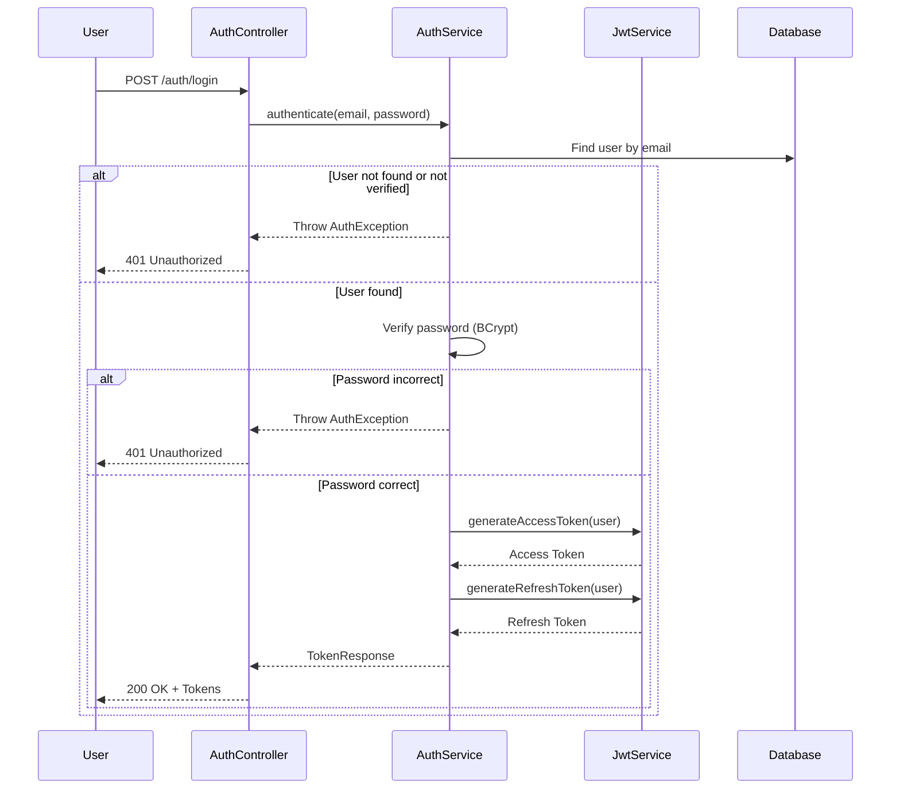
```mermaid
sequenceDiagram
    participant User
    participant Controller as AuthController
    participant Service as AuthService
    participant JWT as JwtService
    participant DB as Database
    
    User->>Controller: POST /auth/login
    Controller->>Service: authenticate(email, password)
    Service->>DB: Find user by email
    alt User not found or not verified
        Service-->>Controller: Throw AuthException
        Controller-->>User: 401 Unauthorized
    else User found
        Service->>Service: Verify password (BCrypt)
        alt Password incorrect
            Service-->>Controller: Throw AuthException
            Controller-->>User: 401 Unauthorized
        else Password correct
            Service->>JWT: generateAccessToken(user)
            JWT-->>Service: Access Token
            Service->>JWT: generateRefreshToken(user)
            JWT-->>Service: Refresh Token
            Service-->>Controller: TokenResponse
            Controller-->>User: 200 OK + Tokens
        end
    end
```

**Key Points:**
- Access token: Short-lived (default: 1 hour)
- Refresh token: Long-lived (default: 7 days)
- Failed login attempts are logged for security audit

---

### 2.3 JWT Validation Flow

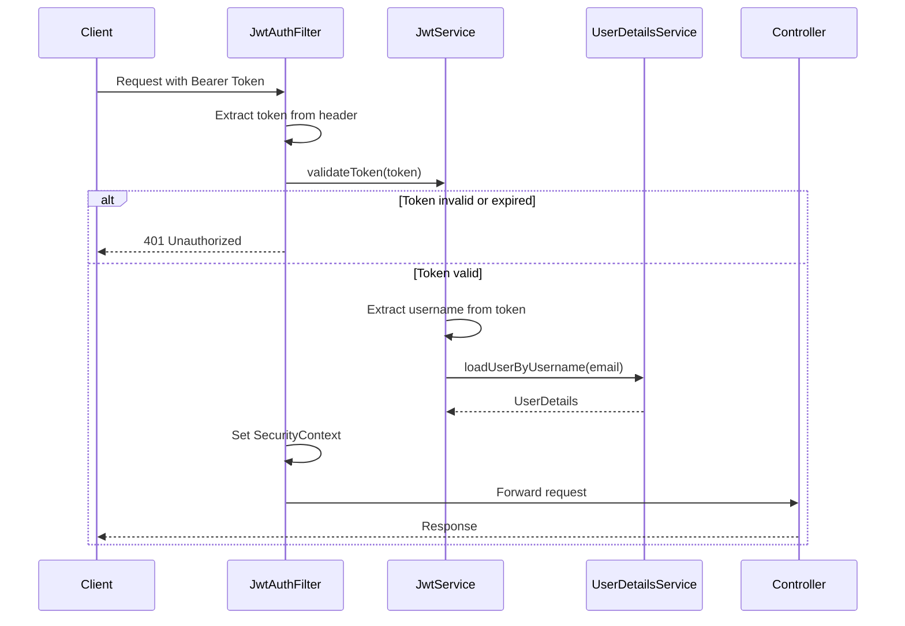
```mermaid
sequenceDiagram
    participant Client
    participant Filter as JwtAuthFilter
    participant JWT as JwtService
    participant UserDetails as UserDetailsService
    participant Controller
    
    Client->>Filter: Request with Bearer Token
    Filter->>Filter: Extract token from header
    Filter->>JWT: validateToken(token)
    alt Token invalid or expired
        Filter-->>Client: 401 Unauthorized
    else Token valid
        JWT->>JWT: Extract username from token
        JWT->>UserDetails: loadUserByUsername(email)
        UserDetails-->>JWT: UserDetails
        Filter->>Filter: Set SecurityContext
        Filter->>Controller: Forward request
        Controller-->>Client: Response
    end
```

---

## 3. Event Management Flow

### 3.1 Event Creation Flow

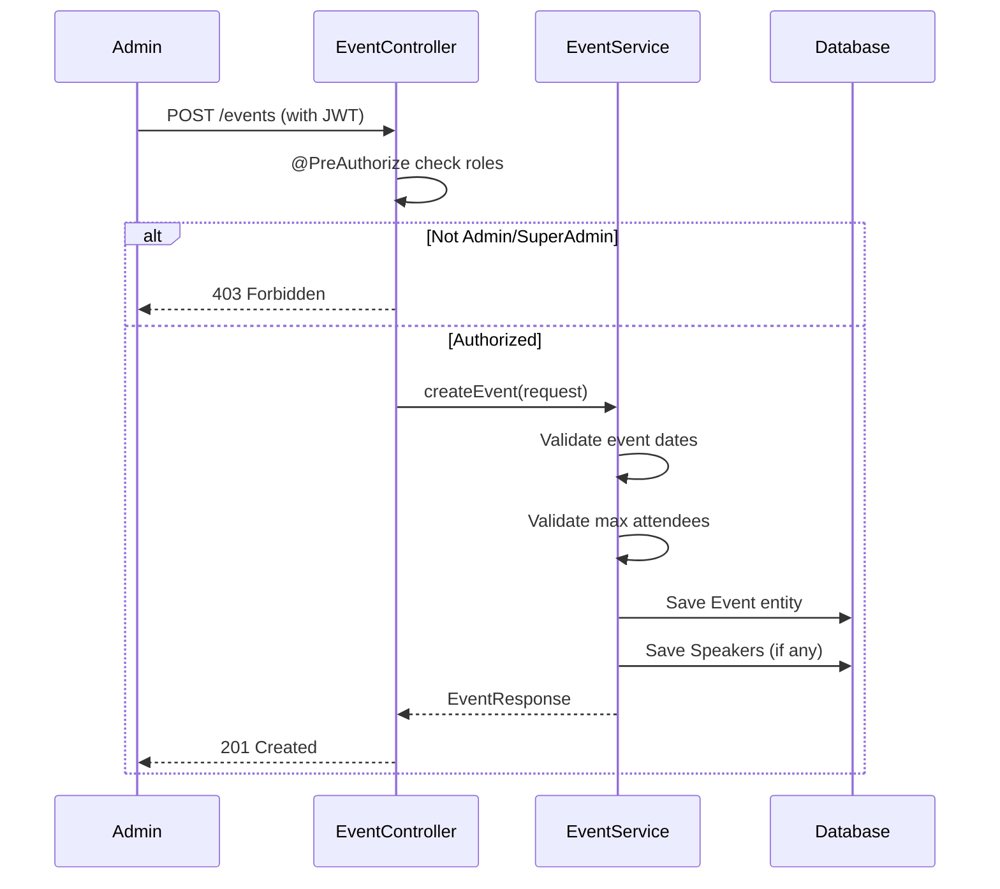
```mermaid
sequenceDiagram
    participant Admin
    participant Controller as EventController
    participant Service as EventService
    participant DB as Database
    
    Admin->>Controller: POST /events (with JWT)
    Controller->>Controller: @PreAuthorize check roles
    alt Not Admin/SuperAdmin
        Controller-->>Admin: 403 Forbidden
    else Authorized
        Controller->>Service: createEvent(request)
        Service->>Service: Validate event dates
        Service->>Service: Validate max attendees
        Service->>DB: Save Event entity
        Service->>DB: Save Speakers (if any)
        Service-->>Controller: EventResponse
        Controller-->>Admin: 201 Created
    end
```

### 3.2 Event Lifecycle

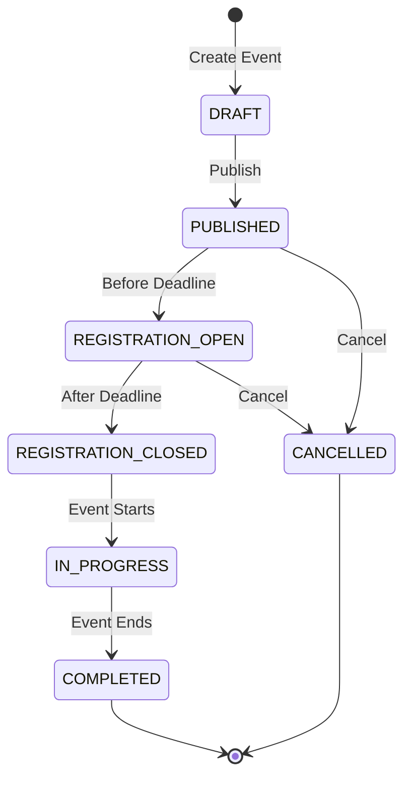
```mermaid
stateDiagram-v2
    [*] --> DRAFT: Create Event
    DRAFT --> PUBLISHED: Publish
    PUBLISHED --> REGISTRATION_OPEN: Before Deadline
    REGISTRATION_OPEN --> REGISTRATION_CLOSED: After Deadline
    REGISTRATION_CLOSED --> IN_PROGRESS: Event Starts
    IN_PROGRESS --> COMPLETED: Event Ends
    COMPLETED --> [*]
    
    PUBLISHED --> CANCELLED: Cancel
    REGISTRATION_OPEN --> CANCELLED: Cancel
    CANCELLED --> [*]
```

---

## 4. Event Registration & Check-in Flow

### 4.1 Enhanced Registration Flow

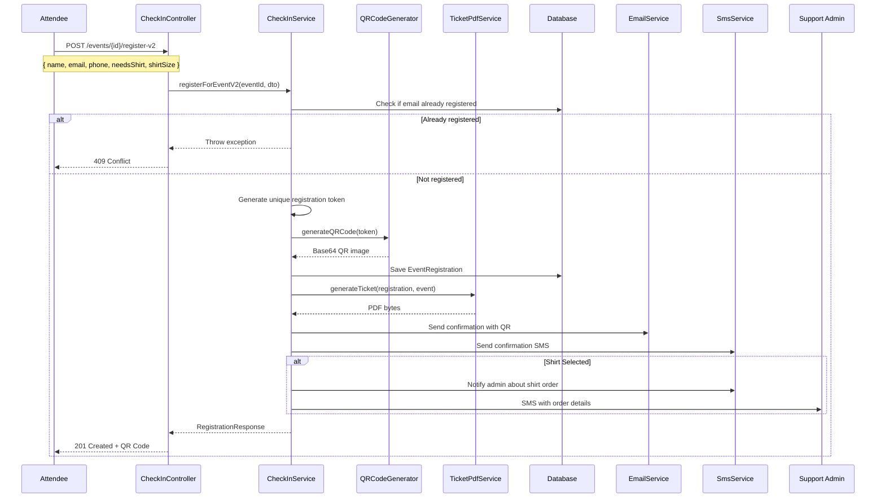
```mermaid
sequenceDiagram
    participant Attendee
    participant Controller as CheckInController
    participant Service as CheckInService
    participant QR as QRCodeGenerator
    participant PDF as TicketPdfService
    participant DB as Database
    participant Email as EmailService
    participant SMS as SmsService
    participant Admin as Support Admin
    
    Attendee->>Controller: POST /events/{id}/register-v2
    Note over Attendee,Controller: { name, email, phone, needsShirt, shirtSize }
    Controller->>Service: registerForEventV2(eventId, dto)
    Service->>DB: Check if email already registered
    alt Already registered
        Service-->>Controller: Throw exception
        Controller-->>Attendee: 409 Conflict
    else Not registered
        Service->>Service: Generate unique registration token
        Service->>QR: generateQRCode(token)
        QR-->>Service: Base64 QR image
        Service->>DB: Save EventRegistration
        Service->>PDF: generateTicket(registration, event)
        PDF-->>Service: PDF bytes
        Service->>Email: Send confirmation with QR
        Service->>SMS: Send confirmation SMS
        alt Shirt Selected
            Service->>SMS: Notify admin about shirt order
            Service->>Admin: SMS with order details
        end
        Service-->>Controller: RegistrationResponse
        Controller-->>Attendee: 201 Created + QR Code
    end
```

### 4.2 Registration Request Structure

```json
{
  "name": "John Doe",
  "email": "john@example.com",
  "phone": "+233543358413",
  "note": "Optional notes",
  "needsShirt": true,
  "shirtSize": "L"
}
```

**ShirtSize Enum Values:**
| Value | Display Name |
|-------|--------------|
| XS | Extra Small |
| S | Small |
| M | Medium |
| L | Large |
| XL | Extra Large |
| XXL | 2X Large |
| XXXL | 3X Large |

---

### 4.3 Post-Registration Actions

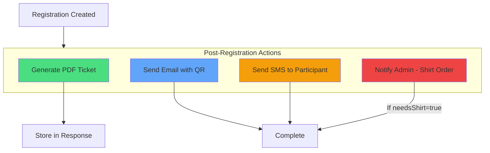
```mermaid
graph TB
    REG[Registration Created] --> ACTIONS
    
    subgraph ACTIONS[Post-Registration Actions]
        PDF[Generate PDF Ticket]
        EMAIL[Send Email with QR]
        SMS[Send SMS to Participant]
        ADMIN[Notify Admin - Shirt Order]
    end
    
    PDF --> STORE[Store in Response]
    EMAIL --> DONE
    SMS --> DONE
    ADMIN -->|If needsShirt=true| DONE[Complete]
    
    style PDF fill:#4ade80
    style EMAIL fill:#60a5fa
    style SMS fill:#f59e0b
    style ADMIN fill:#ef4444
```

**SMS Message Format (Participant):**
```
Hi {name}! You're registered for {eventTitle} on {date}. 
Check your email for your ticket with QR code. See you there! - MerbsConnect
```

**SMS Message Format (Admin - T-Shirt Order):**
```
NEW T-SHIRT ORDER: {name} ({email}) - Size: {shirtSize} - Event: {eventTitle} - Phone: {phone}
```

---

### 4.4 PDF Ticket Generation

The `TicketPdfService` generates a modern, branded PDF ticket:

**Ticket Contents:**
- Event title and branding
- Participant name and email
- Event date, time, and location
- QR code (embedded)
- T-shirt size (if selected)
- Registration token (shortened)

**Design Features:**
- A5 landscape format (ticket-style)
- Red accent bar (matches MerbsConnect branding)
- Clean Helvetica typography
- Light gray right panel for QR code
- Footer with instructions

---

### 4.5 Check-in Process

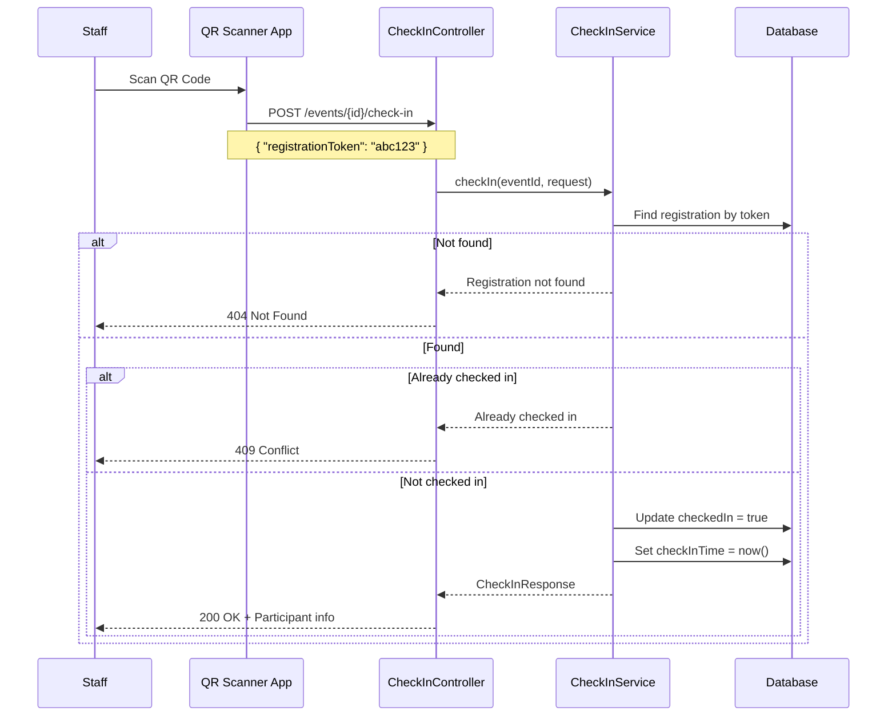
```mermaid
sequenceDiagram
    participant Staff
    participant Scanner as QR Scanner App
    participant Controller as CheckInController
    participant Service as CheckInService
    participant DB as Database
    
    Staff->>Scanner: Scan QR Code
    Scanner->>Controller: POST /events/{id}/check-in
    Note over Scanner,Controller: { "registrationToken": "abc123" }
    Controller->>Service: checkIn(eventId, request)
    Service->>DB: Find registration by token
    alt Not found
        Service-->>Controller: Registration not found
        Controller-->>Staff: 404 Not Found
    else Found
        alt Already checked in
            Service-->>Controller: Already checked in
            Controller-->>Staff: 409 Conflict
        else Not checked in
            Service->>DB: Update checkedIn = true
            Service->>DB: Set checkInTime = now()
            Service-->>Controller: CheckInResponse
            Controller-->>Staff: 200 OK + Participant info
        end
    end
```

---

### 4.6 Ticket Download

Participants can download their PDF ticket anytime:

```http
GET /api/v1/events/{eventId}/registration/ticket?token={registrationToken}
```

**Response:** `application/pdf` file download

---

### 4.7 Check-in Statistics Calculation

```java
totalRegistrations = count all registrations for event
checkedInCount = count where checkedIn = true
pendingCount = totalRegistrations - checkedInCount
checkInPercentage = (checkedInCount / totalRegistrations) * 100
```

---


## 5. Event Reviews System

### 5.1 Review Submission Flow

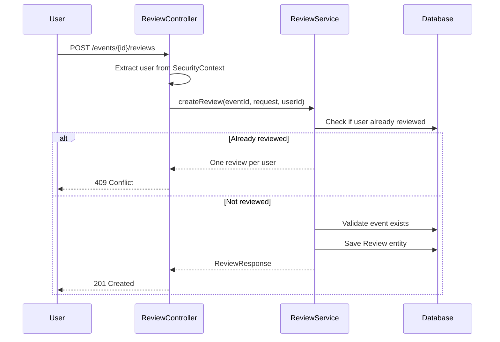
```mermaid
sequenceDiagram
    participant User
    participant Controller as ReviewController
    participant Service as ReviewService
    participant DB as Database
    
    User->>Controller: POST /events/{id}/reviews
    Controller->>Controller: Extract user from SecurityContext
    Controller->>Service: createReview(eventId, request, userId)
    Service->>DB: Check if user already reviewed
    alt Already reviewed
        Service-->>Controller: One review per user
        Controller-->>User: 409 Conflict
    else Not reviewed
        Service->>DB: Validate event exists
        Service->>DB: Save Review entity
        Service-->>Controller: ReviewResponse
        Controller-->>User: 201 Created
    end
```

### 5.2 Review Statistics Calculation

```java
// Fetching reviews with statistics
ReviewPageResponse {
    reviews: List<Review>
    averageRating: AVG(rating) from all reviews
    totalReviews: COUNT(reviews)
    ratingDistribution: {
        5: COUNT where rating = 5,
        4: COUNT where rating = 4,
        3: COUNT where rating = 3,
        2: COUNT where rating = 2,
        1: COUNT where rating = 1
    }
}
```

---

## 6. Event Gallery System

### 6.1 Media Upload Flow

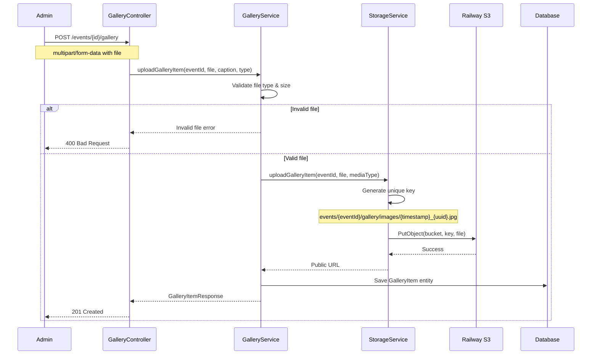
```mermaid
sequenceDiagram
    participant Admin
    participant Controller as GalleryController
    participant Service as GalleryService
    participant Storage as StorageService
    participant S3 as Railway S3
    participant DB as Database
    
    Admin->>Controller: POST /events/{id}/gallery
    Note over Admin,Controller: multipart/form-data with file
    Controller->>Service: uploadGalleryItem(eventId, file, caption, type)
    Service->>Service: Validate file type & size
    alt Invalid file
        Service-->>Controller: Invalid file error
        Controller-->>Admin: 400 Bad Request
    else Valid file
        Service->>Storage: uploadGalleryItem(eventId, file, mediaType)
        Storage->>Storage: Generate unique key
        Note over Storage: events/{eventId}/gallery/images/{timestamp}_{uuid}.jpg
        Storage->>S3: PutObject(bucket, key, file)
        S3-->>Storage: Success
        Storage-->>Service: Public URL
        Service->>DB: Save GalleryItem entity
        Service-->>Controller: GalleryItemResponse
        Controller-->>Admin: 201 Created
    end
```

**File Validation Rules:**
| Type | Allowed Formats | Max Size |
|------|-----------------|----------|
| IMAGE | JPEG, PNG, GIF, WebP | 10 MB |
| VIDEO | MP4, WebM, QuickTime | 100 MB |

---

## 7. Event Articles System

### 7.1 Article Flow

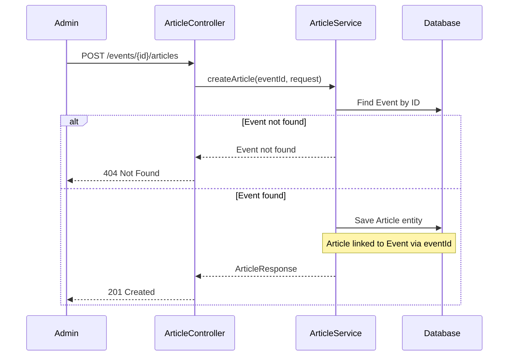
```mermaid
sequenceDiagram
    participant Admin
    participant Controller as ArticleController
    participant Service as ArticleService
    participant DB as Database
    
    Admin->>Controller: POST /events/{id}/articles
    Controller->>Service: createArticle(eventId, request)
    Service->>DB: Find Event by ID
    alt Event not found
        Service-->>Controller: Event not found
        Controller-->>Admin: 404 Not Found
    else Event found
        Service->>DB: Save Article entity
        Note over Service,DB: Article linked to Event via eventId
        Service-->>Controller: ArticleResponse
        Controller-->>Admin: 201 Created
    end
```

**Article Entity Structure:**
```java
Article {
    id: Long
    title: String
    content: String (Markdown supported)
    author: String
    event: Event (ManyToOne)
    createdAt: LocalDateTime
    updatedAt: LocalDateTime
}
```

---

## 8. SMS Notification System

### 8.1 Bulk SMS Flow

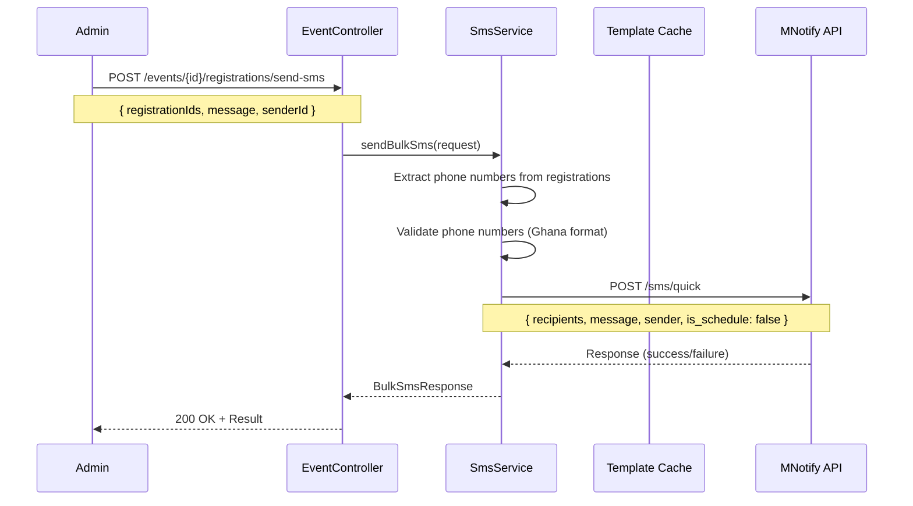
```mermaid
sequenceDiagram
    participant Admin
    participant Controller as EventController
    participant Service as SmsService
    participant Cache as Template Cache
    participant MNotify as MNotify API
    
    Admin->>Controller: POST /events/{id}/registrations/send-sms
    Note over Admin,Controller: { registrationIds, message, senderId }
    Controller->>Service: sendBulkSms(request)
    Service->>Service: Extract phone numbers from registrations
    Service->>Service: Validate phone numbers (Ghana format)
    Service->>MNotify: POST /sms/quick
    Note over Service,MNotify: { recipients, message, sender, is_schedule: false }
    MNotify-->>Service: Response (success/failure)
    Service-->>Controller: BulkSmsResponse
    Controller-->>Admin: 200 OK + Result
```

### 8.2 Template Management

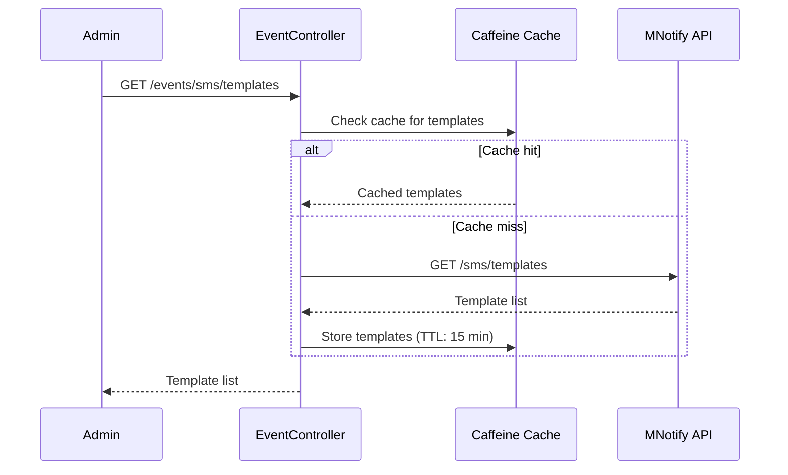
```mermaid
sequenceDiagram
    participant Admin
    participant Controller as EventController
    participant Cache as Caffeine Cache
    participant MNotify as MNotify API
    
    Admin->>Controller: GET /events/sms/templates
    Controller->>Cache: Check cache for templates
    alt Cache hit
        Cache-->>Controller: Cached templates
    else Cache miss
        Controller->>MNotify: GET /sms/templates
        MNotify-->>Controller: Template list
        Controller->>Cache: Store templates (TTL: 15 min)
    end
    Controller-->>Admin: Template list
```

---

## 9. Admin Dashboard Flow

### 9.1 System Statistics Flow

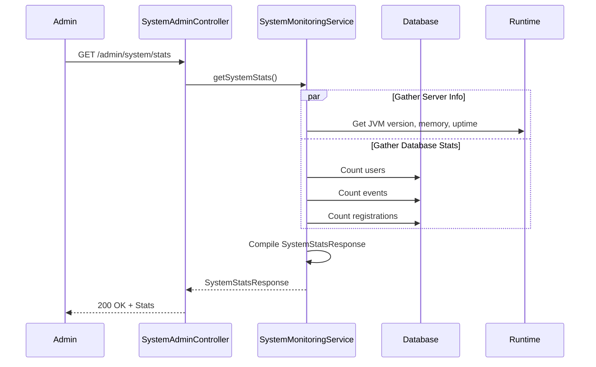
```mermaid
sequenceDiagram
    participant Admin
    participant Controller as SystemAdminController
    participant Service as SystemMonitoringService
    participant DB as Database
    participant JVM as Runtime
    
    Admin->>Controller: GET /admin/system/stats
    Controller->>Service: getSystemStats()
    
    par Gather Server Info
        Service->>JVM: Get JVM version, memory, uptime
    and Gather Database Stats
        Service->>DB: Count users
        Service->>DB: Count events
        Service->>DB: Count registrations
    end
    
    Service->>Service: Compile SystemStatsResponse
    Service-->>Controller: SystemStatsResponse
    Controller-->>Admin: 200 OK + Stats
```

### 9.2 User Management Flow

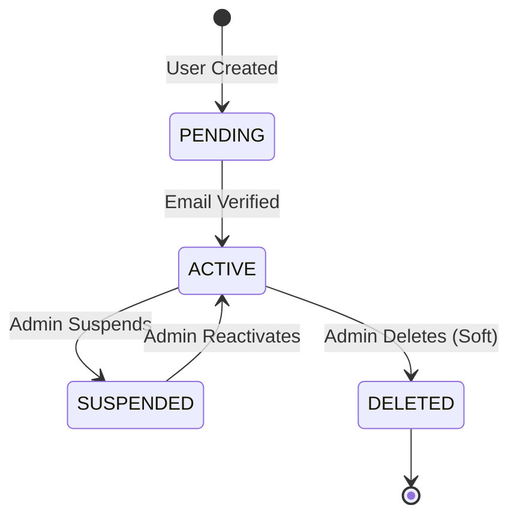
```mermaid
stateDiagram-v2
    [*] --> PENDING: User Created
    PENDING --> ACTIVE: Email Verified
    ACTIVE --> SUSPENDED: Admin Suspends
    SUSPENDED --> ACTIVE: Admin Reactivates
    ACTIVE --> DELETED: Admin Deletes (Soft)
    DELETED --> [*]
```

---

## 10. Storage System

### 10.1 Railway S3 Integration

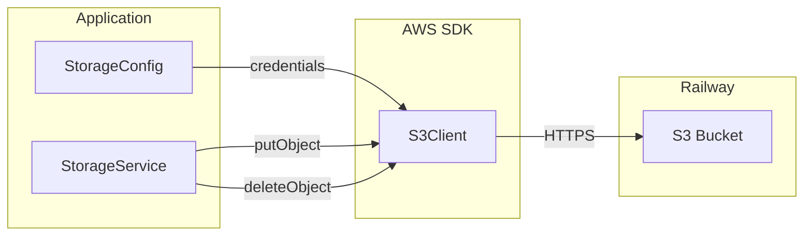
```mermaid
graph LR
    subgraph "Application"
        SVC["StorageService"]
        CFG["StorageConfig"]
    end
    
    subgraph "AWS SDK"
        S3C["S3Client"]
    end
    
    subgraph "Railway"
        BUCKET["S3 Bucket"]
    end
    
    CFG -->|credentials| S3C
    SVC -->|putObject| S3C
    SVC -->|deleteObject| S3C
    S3C -->|HTTPS| BUCKET
```

**Configuration:**
```yaml
railway:
  storage:
    endpoint: https://storage.railway.app
    bucket: functional-case-wjpzk8lgw
    access-key-id: ${RAILWAY_STORAGE_ACCESS_KEY_ID}
    secret-access-key: ${RAILWAY_STORAGE_SECRET_ACCESS_KEY}
    region: auto
```

**File Organization:**
```
bucket/
├── events/
│   ├── {eventId}/
│   │   ├── gallery/
│   │   │   ├── images/
│   │   │   │   └── 20260112_093015_abc123.jpg
│   │   │   └── videos/
│   │   │       └── 20260112_093015_def456.mp4
```

---

## Security Considerations

### Authentication Security
- Passwords hashed with BCrypt (cost factor: 10)
- JWT tokens signed with HS256 algorithm
- Refresh tokens stored securely
- Rate limiting on authentication endpoints

### Authorization Matrix

| Endpoint | SUPER_ADMIN | ADMIN | SUPPORT_ADMIN | USER | Public |
|----------|:-----------:|:-----:|:-------------:|:----:|:------:|
| Create Event | ✅ | ✅ | ✅ | ❌ | ❌ |
| View Events | ✅ | ✅ | ✅ | ✅ | ✅ |
| Register | ✅ | ✅ | ✅ | ✅ | ✅ |
| Check-in | ✅ | ✅ | ✅ | ❌ | ❌ |
| Create User | ✅ | ❌ | ❌ | ❌ | ❌ |
| View Audit | ✅ | ✅ | ❌ | ❌ | ❌ |
| Config | ✅ | ❌ | ❌ | ❌ | ❌ |

---

## Error Handling Strategy

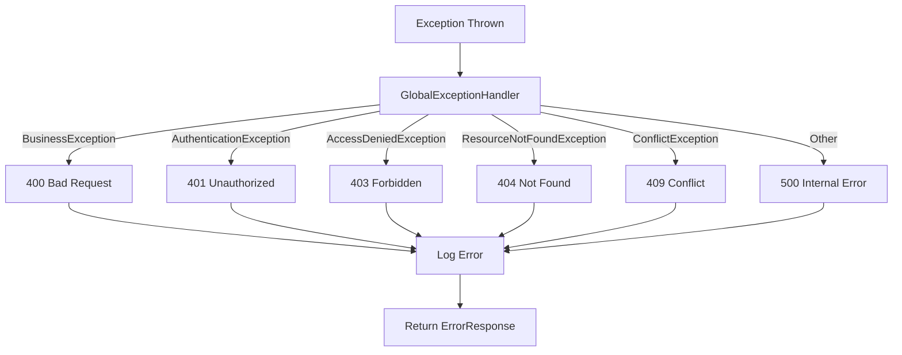
```mermaid
graph TD
    EX[Exception Thrown] --> GEH[GlobalExceptionHandler]
    GEH --> |BusinessException| BE[400 Bad Request]
    GEH --> |AuthenticationException| AE[401 Unauthorized]
    GEH --> |AccessDeniedException| AD[403 Forbidden]
    GEH --> |ResourceNotFoundException| NF[404 Not Found]
    GEH --> |ConflictException| CF[409 Conflict]
    GEH --> |Other| ISE[500 Internal Error]
    
    BE --> LOG[Log Error]
    AE --> LOG
    AD --> LOG
    NF --> LOG
    CF --> LOG
    ISE --> LOG
    
    LOG --> RES[Return ErrorResponse]
```

---

## Caching Strategy

| Cache Name | TTL | Purpose |
|------------|-----|---------|
| `smsTemplates` | 15 minutes | MNotify SMS templates |
| `systemStats` | 5 minutes | Dashboard statistics |
| `eventDetails` | 10 minutes | Frequently accessed events |

```java
@Cacheable(cacheNames = "smsTemplates", key = "'all'")
public List<TemplateResponse> getTemplates() { ... }

@CacheEvict(cacheNames = "smsTemplates", allEntries = true)
public void refreshTemplates() { ... }
```
